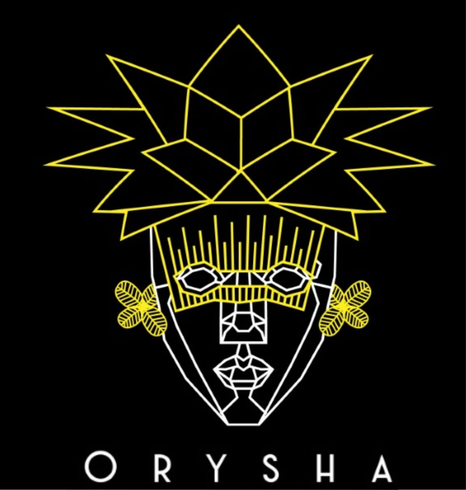

# 

Oysha is an e-commerce site selling a range of clothing, hats and bags with an African influence.

## Table of Contents

- **[User Experience](#User-Experience)**
  - [Project Goals](#Project-Goals)
    - [User Stories](#User-Stories)
- **[Design](#Design)**
  - [Fonts](#Fonts)
  - [Colours](#Colours)
  - [Layout](#Layout)
- **[Features](#Features)**
  - [Existing Features](#Existing-Features)
  - [Future Features](Future-Features)
- **[Technologies](#Technologies)**
  - [Site architecture](#Site-architecture)
  - [Languages](#Languages)
  - [Libraries](#Libraries)
  - [Editors](#Editors)
  - [Tools](#Tools)
  - [Platforms](#Platforms)
- **[Testing](#Testing)**
  - [Validation](#Validation)
  - [Manual Testing](#Manual-Testing)
  - [Known Issues](#Known-Issues)
- **[Deployment](#Deployment)**
  - [Database Deployment](#Database-Deployment)
  - [Deployment Platform](#Deployment-Platform)
- **[Credits](#Credits)**
  - [Media](#Media)
  - [Acknowledgements](#Acknowledgements)

## User Experience

### Project Goals

The project goal is to produce an e-commerce site that users can use to view and purchase items for sale on the site.

### User Stories

New Visitors
- (US001) - To view the products on offer on the website without having to register.
- (US002) - To be able to register an account to the website.
- (US003) - To be able to add items to the shopping basket.
- (US004) - For the items in the shopping basket to remain there after registering an account.
- (US005) - To be able to search and filter for specific products.
- (US006) - To be able to sort displayed products by price and product rating.

Repeat Visitors
- (US007) - To be able to login to my existing account.
- (US008) - To be able to checkout using previously saved details.
- (US009) - To be able to review my order history.

All Visitors
- (US010) - To get confirmation of a successful purchase.
- (US011) - For payments to be completed securely.
- (US012) - To be able to view a running total of the shopping basket.

Site Owners
- (US013) - To be able to add new products or update existing products.
- (US014) - For the website to be fully  on all device types.
- (US015) - For payments to be processed without error.
- (US016) - For users to be able to recover their account if they have lost their details.

##  Design

### Fonts

The font used throughout the site is [Arimo](https://fonts.google.com/specimen/Arimo). This was used as it's a clear and stylish font and was obtained from Google Fonts.

### Colours

### Layout

The site is designed to work and be usable on various devices from mobile phones to desktop computers with a responsive layout. The minimum targeted screen width is 320 pixels wide and a maximum tested width of 2560 pixels.

All initial wireframes are available below:

- [Home Page](https://user-images.githubusercontent.com/46917417/131354066-c6b1cf57-e92d-42b3-8c4d-9f90cba0e79e.png)
- [Products Page](https://user-images.githubusercontent.com/46917417/131354177-a59808df-0bca-4f0a-9fa1-089473f4ac56.png)
- [Basket Page](https://user-images.githubusercontent.com/46917417/131354473-4f515990-c3fb-456d-9f2d-87ca5dd192a6.png)
- [Checkout Page](https://user-images.githubusercontent.com/46917417/131354618-0a9723d0-9837-4b6c-8a93-e032cbbba028.png)

## Features

### Existing Features

### Future Features

## Technologies

### Site architecture

### Languages

- [HTML5](https://developer.mozilla.org/en-US/docs/Web/Guide/HTML/HTML5)
  - Used to create the site layout.
- [CSS3](https://developer.mozilla.org/en-US/docs/Web/CSS)
  - Used to style and colour HTML.
- [JavaScript](https://developer.mozilla.org/en-US/docs/Web/JavaScript)
  - Used to create the site's dynamic elements.
- [Python](https://www.python.org/)
  - Used for the backend server and running queries to the database.
- [Jinja](https://jinja.palletsprojects.com/en/2.11.x/)
  - Used to generate and manipulate the site templates.

### Libraries

- [Django](https://www.djangoproject.com/)
    - The project uses the Django framework to create the app.
- [JQuery](https://jquery.com)
    - The project uses JQuery for DOM manipulation.
- [Bootstrap](https://getbootstrap.com/)
    - The project uses Bootstrap to aid in responsive design.

### Editors

- [Balsamic](https://balsamiq.com/)
  - Used to create the website's wireframes.

### Tools

- [Git](https://git-scm.com/)
  - Used for version control (via github desktop).
- [Github desktop](https://desktop.github.com/)
  - Used to push updates and synchronise local code with the remote repository.
- [Github](https://github.com/)
  - Used to store the project repository and deploy the site via github pages.

### Platforms

- [Heroku](https://www.heroku.com/platform)
  - The project uses Heroku as it's deployment platform.

## Testing

### Validation

- [HTML]()

- [CSS]()

- [Python]()

### Manual Testing

### Known Issues

## Deployment

### Database Deployment

#### Connecting to Mongodb

#### Creating or selecting a database

#### Creating a collection

#### Adding an index

### Deployment Platform

#### Creating a Heroku app

#### Setting Environment variables

#### Deployment

## Credits

### Media
- [Portrait beautiful African woman in traditional turban, Kente head wrap, dashiki printing, black afro women vector silhouette Africa batik ethnic geometric decoration Brown color cloth, hairstyle](https://www.shutterstock.com/image-vector/portrait-beautiful-african-woman-traditional-turban-1039870192) by [robin.ph](https://www.shutterstock.com/g/araratart)
-[African American guy in national clothes on a background of a white wall](https://www.shutterstock.com/image-photo/african-american-guy-national-clothes-on-1586383165) by [Mishadp](https://www.shutterstock.com/g/Misha+Chayka)
-[African man wearing traditional clothes](https://www.shutterstock.com/image-photo/african-man-wearing-traditional-clothes-406426096) by [Ranta Images](https://www.shutterstock.com/g/Amazingmikael)
-[Portrait of stylish black african american man at hat and sunglasses against sunny autumn fall background. Rich people in africa at traditional dress.](https://www.shutterstock.com/image-photo/portrait-stylish-black-african-american-man-769823326) by [AS photostudio](https://www.shutterstock.com/g/AS+photo)
-[Young Nigerian on agbada, crosses legs and hands sitting in a traditional painted canvas or muslin fabric cloth studio backdrop or background, suitable for use with portraits and products.](https://www.shutterstock.com/image-photo/young-nigerian-on-agbada-crosses-legs-1246702597) by [Amaechi Osazuwa Desmond](https://www.shutterstock.com/g/Amaechi+Osazuwa+Desmond)

### Acknowledgements
- Assistance and guidance from my mentor Dick Vlaanderen
- Assistance from Code Institute tutors
- Code Institute - Boutique Ado tutorial videos